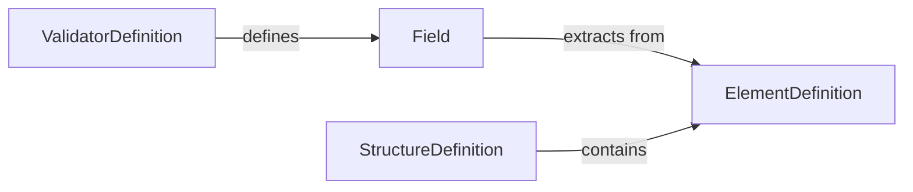

## Relaciones

fhemas trabaja con estructuras y recursos propios que se relacionan con
los recursos FHIR que necesitamos como fuente de verdad para la validación
de instancias de recursos.

## Pipeline

```mermaid
flowchart TD
    IN["Input: SD + VD + indexes"] --> P1

    subgraph COMPILATION["MOMENT 1: COMPILATION"]
        direction TB

        P1["PHASE 1: Load & prepare<br/>- Extract elements from SD<br/>- Prepare compiler context"]
        P1 --> P2

        subgraph P2["PHASE 2: Extract & validate fields"]
            direction TB
            P2A["For each element"] --> P2B["For each field in VD"]
            P2B --> P2C["Extract value using :path"]
            P2C --> P2D{"Multiple<br/>matches?"}
            P2D -->|yes| P2_ERR["Throw error"]
            P2D -->|no| P2E{"Value present?"}
            P2E -->|"no & min=0"| P2_SKIP["Skip field"]
            P2E -->|yes| P2F["Validate cardinality"]
            P2F --> P2G["Validate type"]
        end

        P2 --> P3

        subgraph P3["PHASE 3: Compile"]
            direction TB
            P3A["For each field with a compiler"] --> P3B{"Compiler type?"}
            P3B -->|field| P3C["Pass field value to compiler<br/>→ returns closure"]
            P3B -->|group| P3D["Pass all elements to compiler<br/>→ returns closure"]
            P3C --> P3E["Discard fields without compiler"]
            P3D --> P3E
        end

        P3 --> P4

        P4["PHASE 4: Compose field validators<br/>- For each element: comp closures<br/>- Associate path with validator"]
        P4 --> P5

        P5["PHASE 5: Compose resource validator<br/>- Create orchestrator<br/>- Compose everything into one function"]
    end

    subgraph VALIDATION["MOMENT 2: VALIDATION"]
        direction TB

        P5 --> P6["PHASE 6: Execute validator"]
        P6 --> P6A["For each (path, field-validator)"]
        P6A --> P6B["Extract value from resource using path"]
        P6B --> P6C["Call field validator"]
        P6C --> P6D{"Throws<br/>exception?"}
        P6D -->|yes| P6E["Catch exception<br/>Add expression (path)<br/>Accumulate issue"]
        P6D -->|no| P6F["Continue"]
        P6E --> P6F
        P6F --> P6G["Execute group closures"]
        P6G --> P6H["Convert to OperationOutcome"]
    end

    P6H --> OUT["Output: OperationOutcome"]

```

